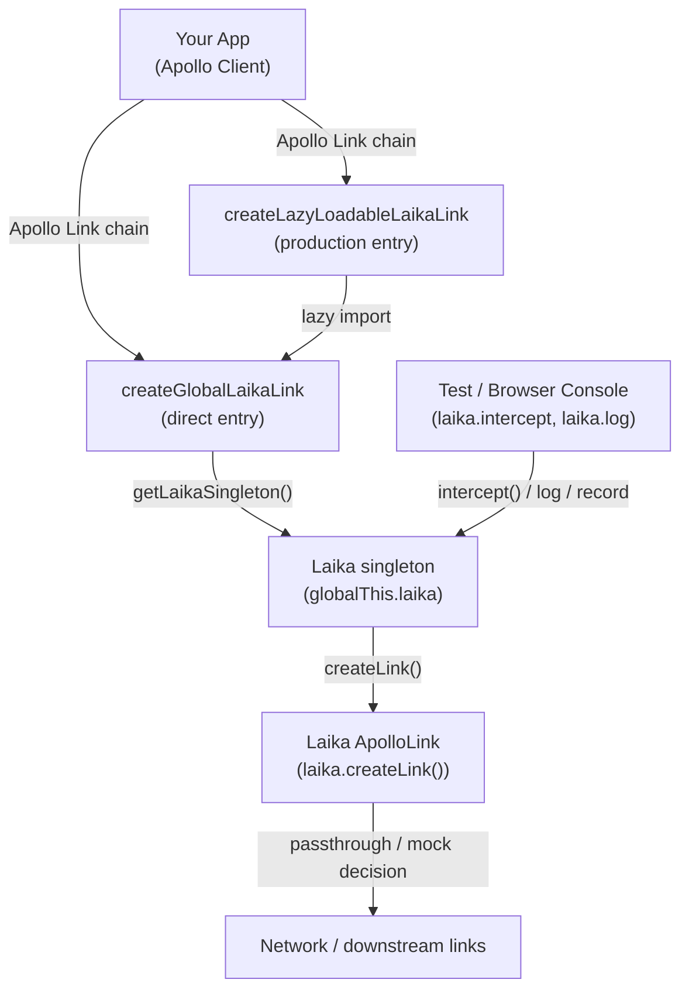

# Laika Architecture

## System Overview

Laika is an Apollo Link middleware library that sits between Apollo Client and your actual network link. It intercepts all GraphQL operations (queries, mutations, subscriptions) in flight and allows tests to mock responses, record real network traffic, and fire subscription updates on demand. The package is distributed as dual CJS + ESM and is designed to be lazily loaded so it has zero impact on production bundle size when not active.

## Architecture Diagram

## Component Map

| File | Responsibility | Key Dependencies |
|------|---------------|-----------------|
| `src/main.ts` | Public package exports | All public modules |
| `src/laika.ts` | Core `Laika` class: intercept management, logging, recording, code gen | `linkUtils`, `hasOperation`, `codeGenerator`, `observableUtils` |
| `src/createGlobalLaikaLink.ts` | Installs Laika singleton on `globalThis`; creates named Apollo Link | `laika.ts`, `constants.ts` |
| `src/createLazyLoadableLaikaLink.ts` | Production-safe lazy-load entry point; defers import of Laika until needed | `createLazyLoadableLink.ts` |
| `src/createLazyLoadableLink.ts` | Generic Apollo Link wrapper that resolves a `Promise<ApolloLink>` | `@apollo/client/core` |
| `src/typedefs.ts` | All TypeScript types and interfaces | `@apollo/client/core`, `graphql` |
| `src/linkUtils.ts` | Resolves `Matcher` → `MatcherFn`; builds emit callbacks | `hasOperation.ts` |
| `src/hasOperation.ts` | Detects operation types (query/mutation/subscription) from GraphQL AST | `graphql` |
| `src/observableUtils.ts` | `mapObservable` helper for transforming Observables | `@apollo/client/core` |
| `src/codeGenerator.ts` | Generates reproducible Jest mock code from recorded sessions | `typedefs`, lodash |
| `src/constants.ts` | `DEFAULT_GLOBAL_PROPERTY_NAME` (`"laika"`), disabled-logging sentinel | — |
| `src/testUtils.ts` | Shared test utilities for unit tests | — |

## Request Flow

### Interception (mocking)
1. Apollo Client fires an operation → traverses the Link chain → reaches `LaikaLink`
2. `LaikaLink` looks up registered `Behavior` entries in `laika.behaviors` (via `interceptor()`)
3. If a matching `Behavior` is found, `onSubscribe()` is called — it emits mock results or enables passthrough
4. If no behavior matches, the operation is added to `unmatchedOperationOptions` and passes through to the network
5. Test code calls `laika.intercept(matcher)` → returns `InterceptApi`; subsequent `mockResult()` / `fireSubscriptionUpdate()` calls deliver data directly to active observers

### Logging / Recording
1. `laika.log.startLogging()` sets `loggingMatcher`
2. Every operation result passes through `getLogFunction()` (via `mapObservable` wrapping the interceptor)
3. If recording is active, results are appended to `this.recording[]`
4. `laika.log.generateMockCode()` passes `recording` to `codeGenerator.ts` → returns a code snippet

### Lazy Loading (production)
1. App bundles `createLazyLoadableLaikaLink` — only a tiny stub at startup
2. When the stub's first operation fires, it dynamically `import()`s `createGlobalLaikaLink`
3. The real `Laika` singleton is created and registered on `globalThis` under `laika`
4. Subsequent operations route through the real link; browser console can now call `window.laika.*`

## Key Design Decisions

### Interceptor-first, passthrough by default
Unmatched operations pass through to the real network link transparently. This makes Laika safe to add to production bundles — it only takes effect when test code calls `laika.intercept()`.

### Global singleton via `getLaikaSingleton` (memoized)
Multiple Apollo Clients (each with a named `clientName`) all share one `Laika` instance. This lets tests coordinate across clients and is why the default global property is `window.laika`.

### Lazy loading for zero production overhead
`createLazyLoadableLaikaLink` uses dynamic `import()` so Laika's code is a separate webpack chunk. Production builds load it only when a flag is set (e.g., an env variable or cookie), keeping the main bundle small.

### Apollo 3 + 4 dual compatibility
The library avoids rxjs Observables in its core (uses `@apollo/client/core`'s `Observable`) and is tested against both Apollo 3 and Apollo 4 via the `tests/compat/` suite.

### Dual CJS + ESM distribution
Built with `tsc` twice — once targeting CommonJS for Node.js test runners and once targeting ES modules for bundlers. Package `exports` field resolves both.

## External Dependencies

| Dependency | Role | Notes |
|------------|------|-------|
| `@apollo/client` | Peer dep; `ApolloLink`, `Observable` | Supports `>=3.2.5 <5` |
| `graphql` | Peer dep; AST types, `print()` | `^15 \|\| ^16` |
| `rxjs` | Optional peer dep; subscription support for Apollo 4 | `^7.3.0` |
| `lodash` | Runtime dep; `isMatch`, `memoize`, code-gen utilities | Tree-shakeable imports |

## Build & Distribution

- `yarn build:cjs` → `cjs/` (CommonJS, ES2015 target)
- `yarn build:esm` → `esm/` (ES modules, ES2015 target)
- `package.json` `exports` field maps `import` → `esm/main.js`, `require` → `cjs/main.js`
- Releasing: semantic-release driven by conventional commits on `main` / `master`

## Cross-Cutting Concerns

### TypeScript
Strict mode enabled with `noUncheckedIndexedAccess`, `noImplicitOverride`, `noImplicitReturns`. All types exported from `src/typedefs.ts`.

### Testing
Jest + SWC. Unit tests co-located with source (`src/*.test.ts`). Compat tests in `tests/compat/` are run against the built package to validate real consumer scenarios.

### Docs
`docs/` is a separate Docusaurus workspace. API reference pages are generated from JSDoc comments via TypeDoc. Docs deploy to GitHub Pages.
